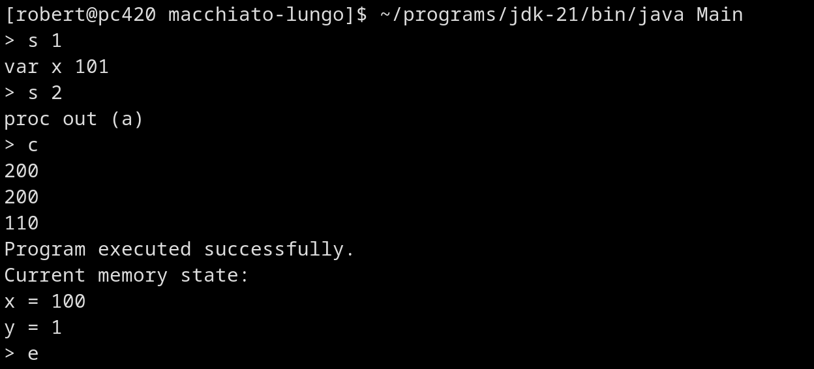

Macchiato Lungo is a programming language implemented by me in java.
The main features are:

   - it can be run with the Macchiato Lungo interpreter,
   - it can be debugged with the Macchiato Lungo debugger,
   - integer variables,
   - flow control,
   - procedures,
   - scopes,
   - dumping memory state into a file.

